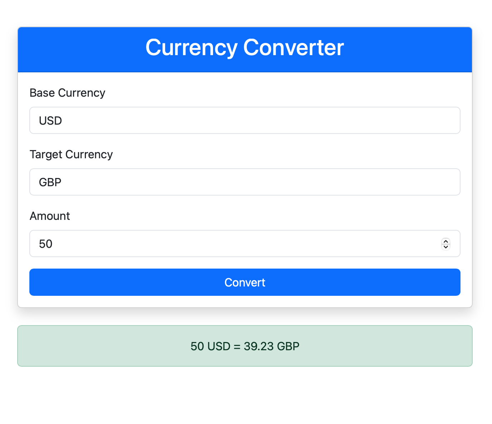

# Data Engineering Mini Project Twelve

This repository is created as an assignment from the Data Engineering course, IDS 706. The aim is to create a simple python application containerized with a dockerfile. 

The requirements are:
The goal here is to both demonstrate running your application within a docker container (using docker run terminal commands) but to also build a docker image in your CI/CD pipeline which will be pushed to Docker Hub or other container management service.

## This is what the python code does

The python code creates a Flask web application that connects to an api, exchangerate-api.com, to convert one current to another based on the request made by the client.

## Steps taken to meet the requirements
1. A docker file was created that uses the official python debian image
1. It does the following:
	- set the working folder
	- copies the flask application into the working folder
	- installs all the application requirements listed in the requirements.txt file
	- creates the port for external access to the application
	- sets Flask enveronment variable the indicates the location of the Flask app
	- finally executes the Flask command to run the web app within the docker container
1. A Github workflow was created to login to Docker Hub, build the Docker Image and push it to Docker Hub
1. 

## Echange Rate API
https://app.exchangerate-api.com